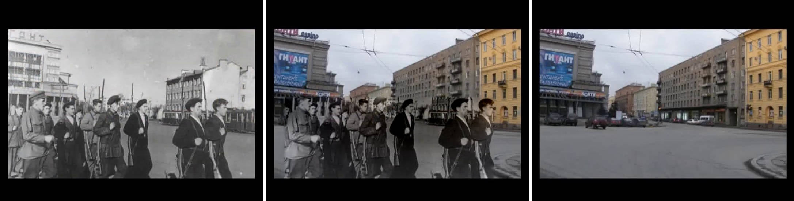

# a-look-into-the-past
final project for computer vision course of USTC 2022 Fall

## directory structure
`extract_frame.py`负责从`leningrad.mp4`进行抽帧，生成所需的图片；`locate.py`调用yolo进行目标检测；`sa_map.py`负责生成显著图以及进行泊松融合；`video_proc.py`负责进行一对多的匹配，也即looks into the past，`main.py`是主要部分，它接收一个命令行参数`homoConvert`，据此进入不同的流程：单应性变换或目标检测+显著图。

```
|-- CV_project_report.pdf  
|-- LICENSE  
|-- README.md  
|-- code  
|   |-- __init__.py  
|   |-- extract_frame.py  
|   |-- locate.py  
|   |-- main.py  
|   |-- run.sh  
|   |-- sa_map.py  
|   `-- video_proc.py  
|-- imgs  
|   |-- gray  
|   |-- result  
|   `-- rgb      
|-- model_data  
|-- nets  
|-- requirement.txt  
|-- utils  
|-- video  
|   |-- leningrad.mp4  
|   |-- pathway.mp4  
`-- yolo.py  

```

## A quick look
Saliency detection region selection:  
  
  


Object detection region selection:  
  
  
  